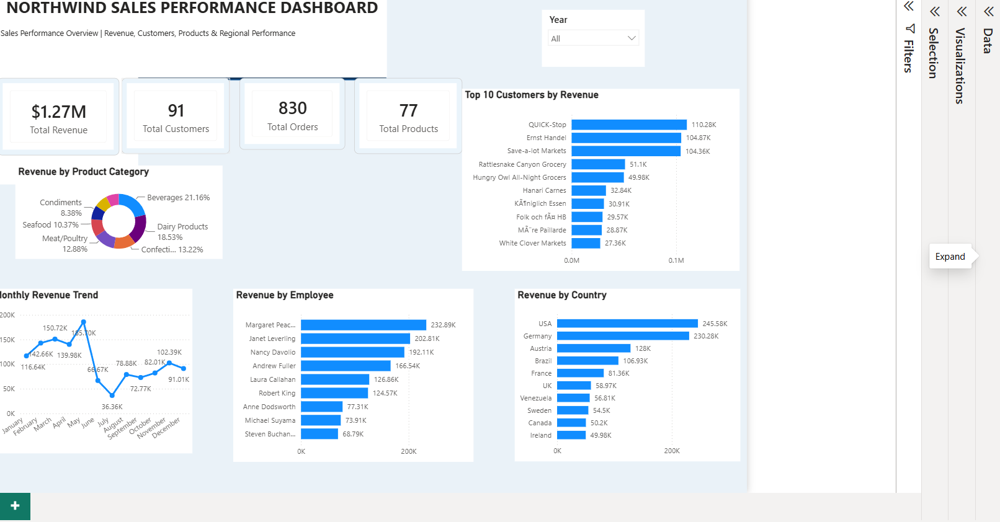

# 📊 Northwind Sales Performance Dashboard

## Project Overview

This project analyses the Northwind sales dataset to understand overall sales performance, customer behaviour, product performance, employee contribution and geographical trends.

The data was transformed and modelled in Power BI, with DAX measures used to calculate key performance indicators and create an interactive dashboard for exploring business performance.

## 📊 Dashboard Preview

## Business Questions

The dashboard was designed to answer questions such as:

- What is the overall revenue generated?
- Which customers generate the most revenue?
- Which product categories contribute the most to sales?
- Which employees generate the highest revenue?
- Which countries are the strongest markets?
- How does revenue change over time?

## 🗄️ SQL Analysis

SQL was used to explore and analyse the Northwind database before developing the Power BI dashboard.

The analysis was organised into five areas:

- **Database Exploration** – explored the database structure and key fields to understand the available data.
- **Customer Analysis** – analysed customer purchasing behaviour and identified high-value customers.
- **Sales Analysis** – examined overall sales performance, revenue patterns and sales trends.
- **Product Analysis** – evaluated product and category performance to identify key revenue contributors.
- **Employee Analysis** – compared employee sales performance and contribution to revenue.

The SQL scripts used for the analysis are included in this repository.

## Key Performance Indicators

- **Total Revenue:** $1.27M
- **Total Customers:** 91
- **Total Orders:** 830
- **Total Products:** 77

## Dashboard Analysis

The dashboard includes:

- Monthly Revenue Trend
- Revenue by Product Category
- Top 10 Customers by Revenue
- Revenue by Employee
- Revenue by Country
- Interactive Year Filter

## Key Insights

- Total revenue reached approximately **$1.27 million**.
- **Beverages** generated the largest share of revenue at approximately **21.16%**.
- **Margaret Peacock** was the highest-performing employee by revenue.
- The **USA** generated the highest revenue among the countries analysed.
- **QUICK-Stop** was the highest-value customer by revenue.
- Monthly revenue fluctuated considerably across the reporting period, highlighting periods of both strong and weaker sales performance.

## Tools & Skills Used

- Microsoft Power BI
- Power Query
- DAX
- Data Transformation
- Data Modelling
- Data Visualisation
- KPI Development
- Sales & Trend Analysis

## Dashboard

A screenshot of the completed interactive Power BI dashboard is included in this repository.

## Project Files

- Power BI dashboard (`.pbix`)
- Dashboard screenshot
- Project documentation

## About This Project

This project was completed as part of my data analytics portfolio to demonstrate my ability to transform business data, develop meaningful KPIs and communicate insights through an interactive Power BI dashboard.
